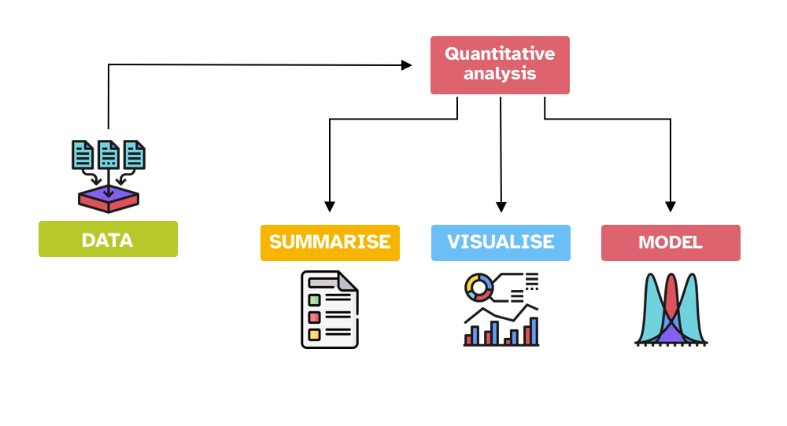

```{r setup, include=FALSE}
knitr::opts_chunk$set(
  echo = TRUE, message = FALSE, out.height = "500px", dpi = 300,
  fig.align = "center", fig.width = 7, fig.height = 5
)
knitr::opts_knit$set(root.dir = here::here())

library(tidyverse)
theme_set(theme_minimal())
library(glue)

library(xaringanExtra)
use_xaringan_extra(c("panelset", "tachyons", "freezeframe"))

options(htmltools.dir.version = FALSE)
```

```{r xaringan-themer, include=FALSE, warning=FALSE}
library(xaringanthemer)
style_mono_accent(
  base_color = "#1c5253",
  header_font_google = google_font("Josefin Sans"),
  text_font_google   = google_font("Montserrat", "300", "300i", "700", "700i"),
  code_font_google   = google_font("Fira Mono"),
  outfile = "./slides/xaringan-themer.css"
)
```

```{r mald, echo=FALSE}
mald <- readRDS("./data/mald.rds")
```

class: inverse right middle

.f2[The numbers have no way of speaking for themselves. We speak for them. We imbue them with meaning.]

— Nate Silver, *The Signal and the Noise*

---

## Inference process

.center[

]

???

We take a **sample** from the population.

This is our empirical data (the product of observation).

How do we go from data/observation to answering our question?

We can use **inference**.

**Inference** is the process of understanding something about a population based on the sample (aka the data) taken from that population.

---

class: middle center inverse

## Inference is not infallible

???

However, inference based on data does not guarantee that the answers to our questions are right/true.

In fact, any observation we make comes with a degree of **uncertainty and variability**.

EXTRA: Check out this article: <https://www.scientificamerican.com/article/if-you-say-science-is-right-youre-wrong/>

EXTRA: Find out about Popper's view of falsification and fallibilism.

---

## Uncertainty and variability

.center[

]

???

So we have to deal with:

- Uncertainty in any observation of a phenomenon.

- Variability among different observations of the same phenomenon.

---

class: center, middle, inverse


???

Guess what it is...

---

class: center middle inverse

## *Statistics* as a tool to deal with *uncertainty* and *variability*

???

Statistics helps us quantifying uncertainty and accounting for variability.

---

## Statistics

.center[

]

---

## Statistical model

.bg-washed-blue.b--dark-blue.ba.bw2.br3.shadow-5.ph4.mt2[
A **statistical model** is a mathematical model that represents the relationship between variables in the data.
]

--

<br>

> All models are wrong, but some are useful.

—[George Box](https://en.wikipedia.org/wiki/All_models_are_wrong)

---

layout: true

## The MALD dataset

---

[Massive Auditory Lexical Decision](https://aphl.artsrn.ualberta.ca/?page_id=827) (Tucker et al. 2019):

- **MALD data set**: 521 subjects, RTs and accuracy.

- Subset of MALD: 30 subjects, 100 observations each.

- Let's investigate the effect of *mean phone-level Levenshtein distance* and *lexical status* (word vs non-word).

--

```{r mald-print}
mald
```

---

```{r rt-1, message=FALSE, echo=FALSE}
mald %>%
  ggplot(aes(IsWord, RT)) +
  geom_jitter(width = 0.2, alpha = 0.1) +
  geom_violin(width = 0.2, aes(fill = IsWord)) +
  stat_summary(fun.data = "median_hilow", geom = "point") +
  theme(legend.position = "none")
```

---

```{r rt-2, message=FALSE, echo=FALSE}
mald %>%
  ggplot(aes(PhonLev, RT)) +
  geom_point(alpha = 0.05) +
  geom_smooth(method = "lm", colour = "purple")
```

---

```{r rt-3, message=FALSE, echo=FALSE}
mald %>%
  ggplot(aes(PhonLev, RT)) +
  geom_point(alpha = 0.05) +
  geom_smooth(aes(colour = IsWord, fill = IsWord), method = "lm")
```

---

layout: true

## Probabilities

---

.bg-washed-blue.b--dark-blue.ba.bw2.br3.shadow-5.ph4.mt2[
**Probability**

- Probability of an **event occurring** or of a **variable taking on a specific value**.

- Probabilities can only be **between 0 and 1**.

  - ⛔️ 0 means **impossible**.
  - 🤷 0.5 means **it can happen but it can also not happen**.
  - ✅ 1 means **certain**.
]

--

.center[

]

---

.bg-washed-blue.b--dark-blue.ba.bw2.br3.shadow-5.ph4.mt2[
**Probability**

- Probability of an event occurring: 0 to 100% probability.

- **Probability of a variable taking on a specific value**: a bit more complicated...
]

.bg-washed-green.b--dark-green.ba.bw2.br3.shadow-5.ph4.mt2[
**We need probability distributions!**
]

---

layout: false
layout: true

## Probability distributions

---

<br>


---

.bg-washed-blue.b--dark-blue.ba.bw2.br3.shadow-5.ph4.mt2[
A **probability distribution** is a mathematical function that describes *how the probabilities are distributed over the values* that a variable can take on.
]

--

.bg-washed-blue.b--dark-blue.ba.bw2.br3.shadow-5.ph4.mt2[
Two types of probability distributions

- **Discrete probability distributions.**

- **Continuous probability distributions.**
]

--

.bg-washed-green.b--dark-green.ba.bw2.br3.shadow-5.ph4.mt2[
Discrete variables follow discrete probability distributions and continuous variables follow continuous probability distributions.
]

---

.bg-washed-blue.b--dark-blue.ba.bw2.br3.shadow-5.ph4.mt2[
We can **visualise probability distributions**:

- Using the **probability mass function** for discrete probability distributions.

- Using the **probability density function** for continuous probability distributions.
]

--

.bg-washed-green.b--dark-green.ba.bw2.br3.shadow-5.ph4.mt2[
You don't need to understand the math behind this, but you are free to learn about it through the internet search engine of your choice!
]

---

**Probability Density Function**

```{r rt-dens, echo=FALSE}
rt_dens <- mald %>%
  ggplot(aes(RT)) +
  geom_density(fill = "#9970ab", alpha = 0.5) +
  geom_rug(alpha = 0.05) +
  scale_x_continuous(n.breaks = 10) +
  labs(
    title = "Expected probability density of RT",
    x = "RT", y = "Probability density (relative probability)"
  )
rt_dens
```

---

.bg-washed-blue.b--dark-blue.ba.bw2.br3.shadow-5.ph4.mt2[
**Probability distributions can be expressed using parameters.**

- We can summarise a probability distribution by specifying the **parameters' values**.

- Different types of probability distributions have a different number of parameters and different parameters.
]

--

.bg-washed-green.b--dark-green.ba.bw2.br3.shadow-5.ph4.mt2[
The **Gaussian probability distribution** is a continuous probability distribution and it has two parameters:

- The mean $\mu$.
- The standard deviation $\sigma$.

]

Go to **[Seeing Theory](https://seeing-theory.brown.edu/probability-distributions/index.html#section2)**.

???

Seeing Theory was created by Daniel Kunin while an undergraduate at Brown University. The goal of this website is to make statistics more accessible through interactive visualizations (designed using Mike Bostock’s JavaScript library D3.js).

<https://seeing-theory.brown.edu/index.html#3rdPage>

---

```{r rt-dist-2, echo=FALSE}
rt_mean <- mean(mald$RT)
rt_sd <- sd(mald$RT)
rt_mean_text <- glue("mean: {round(rt_mean)} ms")
rt_sd_text <- glue("SD: {round(rt_sd)} ms")

rt_dist_2 <- ggplot(data = tibble(x = -500:2500), aes(x)) +
  stat_function(fun = dnorm, n = 101, args = list(rt_mean, rt_sd), colour = "#9970ab", linewidth = 1.5) +
  scale_x_continuous(n.breaks = 5) +
  geom_vline(xintercept = rt_mean, colour = "#1b7837", linewidth = 1) +
  annotate(
    "label", x = rt_mean + 1, y = 0.0006,
    label = rt_mean_text,
    fill = "#1b7837", colour = "white"
  ) +
  annotate(
    "label", x = 2000, y = 0.0006,
    label = rt_sd_text,
    fill = "#8c510a", colour = "white"
  ) +
  annotate(
    "label", x = 5, y = 0.0006,
    label = "theoretical sample\ndistribution",
    fill = "#9970ab", colour = "white"
  ) +
  labs(
    title = "Theoretical sample distribution of RT",
    subtitle = glue("Gaussian distribution: mean = {round(rt_mean)} ms, SD = {round(rt_sd)}"),
    x = "RT (ms)", y = "Relative probability"
  )
rt_dist_2
```

---

```{r rt-dist-2-2, echo=FALSE}
rt_dist_2 +
  geom_density(data = mald, aes(RT), colour = "grey", fill = "grey", alpha = 0.2) +
  geom_rug(data = mald, aes(RT), alpha = 0.05) +
  annotate(
    "label", x = 20, y = 0.0015,
    label = "empirical sample\ndistribution",
    fill = "grey", colour = "white"
  )
```
