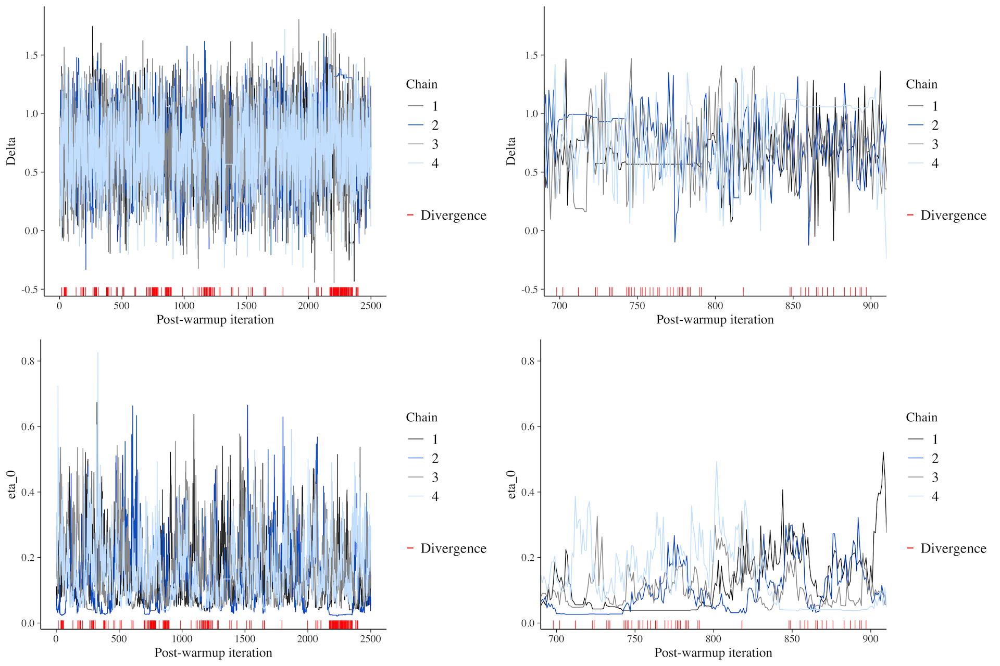

```{r setup, include=FALSE}
knitr::opts_chunk$set(
  echo = TRUE, message = FALSE, out.height = "500px", dpi = 300,
  fig.align = "center", fig.width = 7, fig.height = 5
)
knitr::opts_knit$set(root.dir = here::here())

library(tidyverse)
theme_set(theme_minimal())
library(glue)

library(xaringanExtra)
use_xaringan_extra(c("panelset", "tachyons", "freezeframe"))

options(htmltools.dir.version = FALSE)

library(brms)
library(bayesplot)

my_seed <- 9899
```

```{r mald, echo=FALSE}
mald <- readRDS("./data/mald.rds")
```

```{r rt-bm-4, echo=FALSE}
rt_bm_4 <- readRDS("~/repos/basicBayes/data/cache/rt_bm_4.rds")
```


layout: true

# MCMC chains diagnostics

---

```{r rt-bm-4-chain-1, message=FALSE, out.height="400"}
library(bayesplot)
as.array(rt_bm_4) %>% mcmc_trace("b_Intercept", np = nuts_params(rt_bm_4))
```

---

```{r rt-bm-4-chain-2, message=FALSE, out.height="400"}
as.array(rt_bm_4) %>%
  mcmc_trace("b_IsWordFALSE:PhonLev", np = nuts_params(rt_bm_4))
```

---

An example of bad MCMC chain mixing.

.center[

]

???

Picture from <https://www.rdatagen.net/post/diagnosing-and-dealing-with-estimation-issues-in-the-bayesian-meta-analysis/>.

---

** $\hat{R}$ and Effective Sample Size**

.medium[
```{r rt-bm-4-diag}
rt_bm_4
```
]

---

layout: false

# Posterior predictive checks

```{r rt-bm-4-pp, out.height="400"}
pp_check(rt_bm_4, ndraws = 100)
```
